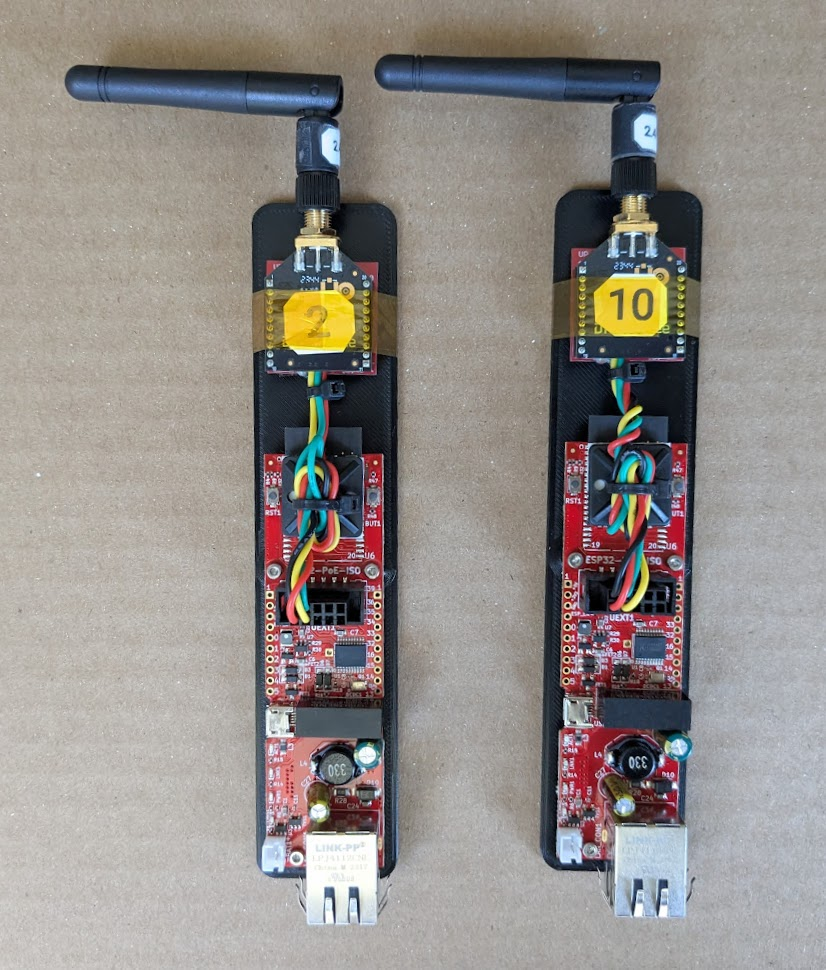

# Transponder

Transponder between cars for the Indy Autonomous Challenge.

Features
- Arduino based
- ROS2 node example
- Powered via PoE

## Theory of Operation
The ESP32-PoE-ISO listens to UDP packets published from the ROS2 node `transponder2ros_node`.
These are then packaged with a header and a checksum and sent out as serial data over the xbee network to all the available nodes.
The ESP32-PoE-ISO takes any received packets over the xbee network, checks their integrity, and converts them back into UDP packets, and forwards them back to the `transponder2ros_node`.
The node then publishes the data out as a `transponder_msgs::msg::Transponder` onto the ROS2 network.

Each air packet is about 40 bytes long, so the network can handle about `XXXXX, to test in real world conditions` packets/sec between all nodes.

## Installation
### ROS2
All dependencies on the ROS2 side can be installed via rosdep.
From your main workspace folder, run `rosdep install --from-paths src --ignore-src -r -y`.
If you have trouble with finding geographiclibs, debian/ubuntu installs `FindGeographicLib.cmake` in a non-standard location, but this should be covered in the `CMakeLists.txt` file.

### Arduino
The Arduino code is only required to update the transponder firmware.
See the [Arduino README.md](arduino/README.md) for installation instructions.

### XBee
[XTCU](https://www.digi.com/products/embedded-systems/digi-xbee/digi-xbee-tools/xctu) is used to configure the XBee.  This should only be required once.

## Component Setup
See the individual README.md files in each folder for more information - [ESP32-PoE-ISO (Arduino)](arduino/README.md) / [ROS](ros/README.md) / [XBee](xbee/README.md) / [Hardware](hardware/README.md).
