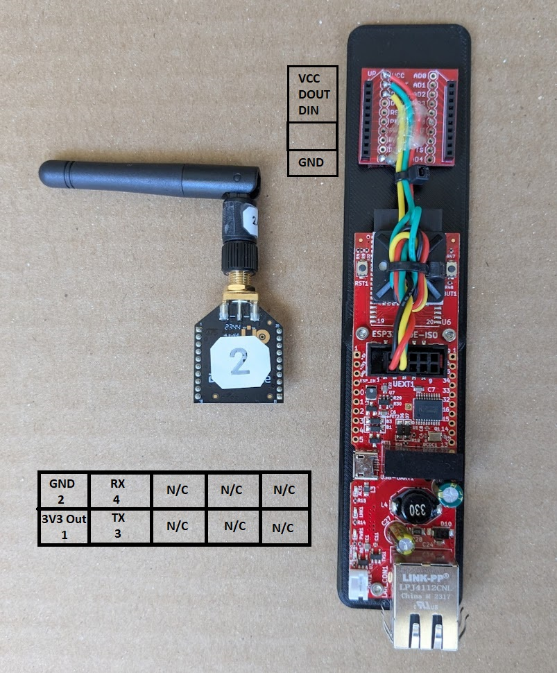

# Transponder Hardware

## Bill of Materials
- Compute
  - Olimex ESP32-PoE-ISO
    - https://www.digikey.com/en/products/detail/olimex-ltd/ESP32-POE-ISO/10258716
- Radio
  - Xbee radio
    - https://www.digikey.com/en/products/detail/digi/XB3-24Z8ST/8130935
  - Xbee breakout
    - https://www.digikey.com/en/products/detail/sparkfun-electronics/BOB-08276/5318741
  - Xbee headers
    - https://www.digikey.com/en/products/detail/adafruit-industries-llc/366/5629440
  - Xbee to USB breakout (recommended for programming Xbees)
    - https://www.digikey.com/en/products/detail/sparkfun-electronics/11812/5762455
- Antennas
  - Antenna (small)
    - https://www.digikey.com/en/products/detail/te-connectivity-linx/ANT-2-4-LCW-RPS/9607800
  - Antenna (large)
    - https://www.digikey.com/en/products/detail/taoglas-limited/FW-24-SMA-M/7035228
- Extension Cables
  - 250 mm (9.8") RP-SMA to RP-SMA
    - https://www.digikey.com/en/products/detail/sparkfun-electronics/22037/21443079
  - 1 m (3'3") RP-SMA to RP-SMA
    - https://www.digikey.com/en/products/detail/sparkfun-electronics/22036/21443073

## Wiring
26 AWG is a good choice for wiring guage, however down to 30 AWG will work fine too.
You can use 0.1" headers (female dupont) for connecting to the ESP32-PoE-ISO.

| Colour  | Voltage | ESP32-PoE-ISO   | XBee |
| ------- | ------- | --------------- | ---- |
| Red     | 3V3     | +3.3V (Pin 1)   | VCC  |
| Black   | GND     | GND (Pin 2)     | GND  |
| Yellow  | 3V3     | U1TXD (Pin 3)   | DIN  |
| Green   | 3V3     | U1RXD (Pin 4)   | DOUT |

> **Warning:** Different XBee breakout boards may take different voltages in or have slightly different locations for each of the pins.
Make sure to double check your wiring and use a multimeter before first connecting everything.

Finally, make sure to hotglue down the wires to help load alleviate the solder joints.

## Assembly
The attached STL (Solidworks files included) can be 3D printed to give a mount that can be used to join the parts together.
- Three [M2x6 socket head cap screws](https://www.mcmaster.com/91292a831/) are used for mounting the ESP32-PoE-ISO to the board.
  - You could probably also use double-sided tape and a cable tie, but things might get a little warm.
- Double-sided tape is used to mount the XBee to the board
  - Hold the XBee to the board by wrapping tape around.
- Clean up your cables.
  - A 0.75" x 0.75" cable tie mount works well
  - Don't pull the cables too tightly
