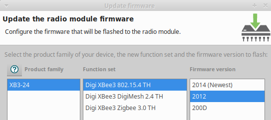

# XBee 

## Configuration
- Download XCTU from
- Connect to the xbee, and apply the profile in `xbee/iac_default.pro`.
  - Update the parameters and the firmware.  If it doesn't update the firmware, apply the settings, and upload the profile again. 
  - Remember to click the `Write` button!
- Power cycle the XBee.  The baud rate will be switched to 57600 baud.
- Connect again and set the `Node Identifier` to the car number for easy remote identification.
  - Remember to click the `Write` button.

## Images

